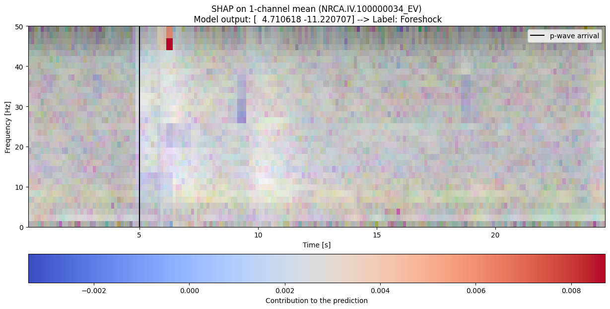
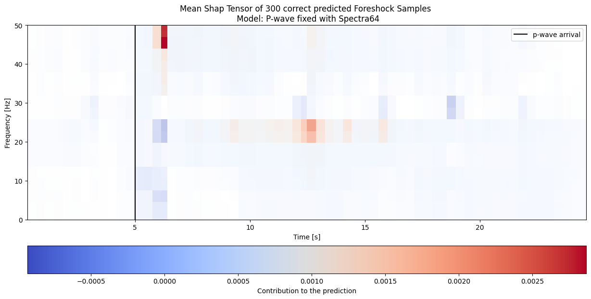

## Overview  
This project explores the application of explainability techniques in deep learning models trained on seismic data. Inspired by the work of Laurenti et al. [[1]](https://www.nature.com/articles/s41467-024-54153-w), we focus on understanding what machine learning models learn when classifying foreshocks and aftershocks or predicting earthquake magnitude. Using SHAP (SHapley Additive exPlanations), we analyze the importance of input features derived from seismic waveforms, converted into spectrograms.

We trained four similar CNN models—differing only in their input dimensions—using four distinct types of spectrograms with the task of classify each event (from NRCA station) in foreshock or aftershock. We varied the spectrogram creation settings as follows:

  - Spectra64: Generated with NPERSEG = 64 and NOVERLAP set to 50% of NPERSEG.
  - Spectra32: Generated with NPERSEG = 32 and NOVERLAP set to 80% of NPERSEG.

Additionally, the spectrograms were categorized based on wave arrival:

  - P-fixed: P-wave arrival fixed at 5 seconds, with spectrograms capturing 5 seconds before and 20 seconds after the P-wave.
  - S-fixed: S-wave arrival fixed at 5 seconds, with spectrograms capturing 5 seconds before and 15 seconds after the S-wave.

So the four models are:

  - P64: Spectra64 on P-fixed
  - P32: Spectra32 on P-fixed
  - S64: Spectra64 on S-fixed
  - S32: Spectra32 on S-fixed

## Content  

### Preprocessing Notebook 
(`preprocessing/preprocess.ipynb`)
  - Prepares the raw seismic waveforms for use in training models.  

### CNN Training 
(`training/p_wave_model_training.ipynb` and `training/p_wave_model_training.ipynb`)
  - Trains the four CNNs on three-channel log-spectrograms for binary classification (foreshocks vs. aftershocks).
  - Saves the checkpoint for each model.   

### SHAP Analysis 
(`explainability/explainability_p.ipynb` and `explainability/explainability_s.ipynb`)
  - Load the previously traained models.
  - Compute single-event shap tensor or batch mean shap tensors. 

   #### Plots of SHAP tensor examples
  - Single SHAP with RGB event on background:
            
  - Mean SHAP with white background:
            

## How to Use  

1. **Download the Dataset**
   
   Download link (work in progress...)

3. **Clone the repository**  
   ```bash  
   git clone [https://github.com/mich1803/CNN-Explainability-on-Earthquakes/](https://github.com/mich1803/CNN-Explainability-on-Earthquakes/)
   cd your_path/CNN-explainability-Earthquakes  
   ```

4. **Create and activate Virtual Environment**
    ```bash  
    python3 -m venv CNN_EQML
    source CNN_EQML/bin/activate
   ```

5. **Install dependecies**
    ```bash 
    pip install -r requirements.txt  
    ```

---

## References  

1. **Laurenti, Paolini et al. (Nature 2024)**  
   - [***Probing the Evolution of Fault Properties During the Seismic Cycle with Deep Learning***](https://www.nature.com/articles/s41467-024-54153-w)
